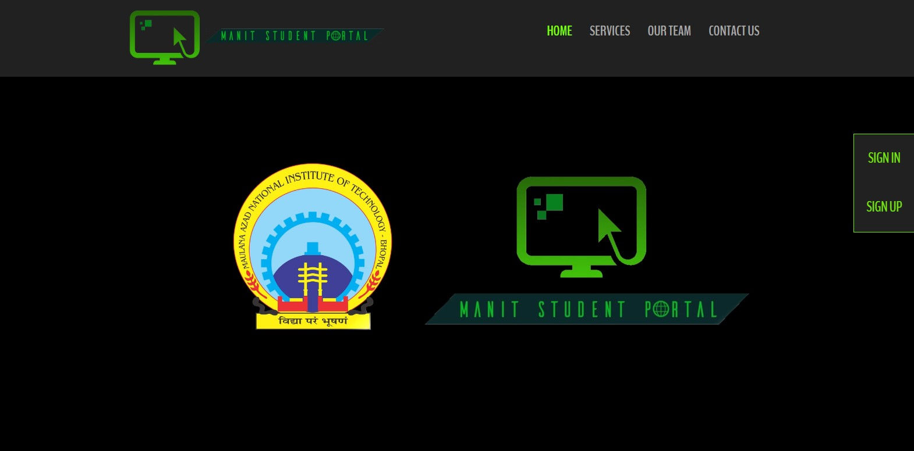
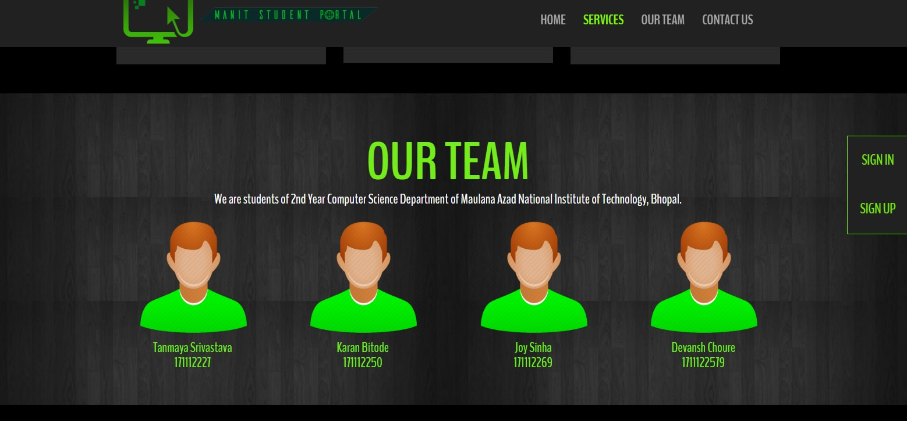
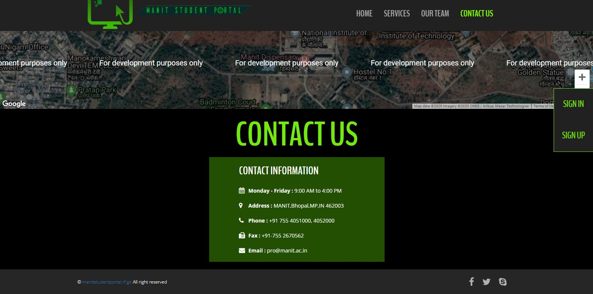
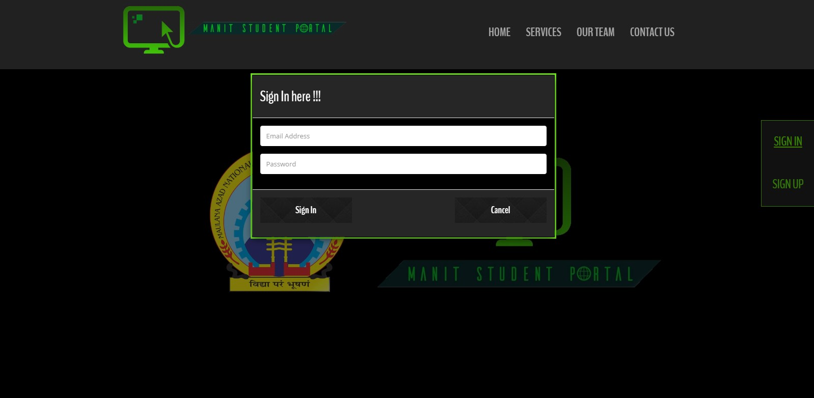
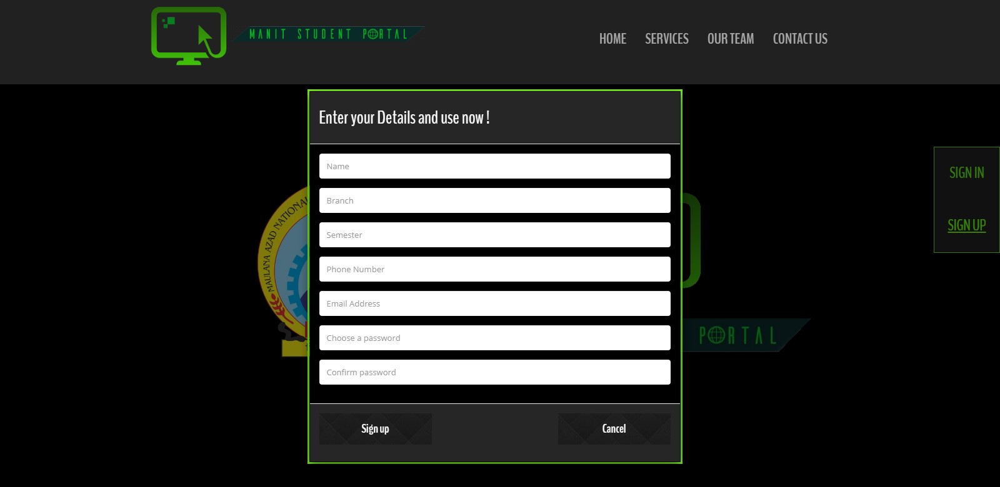
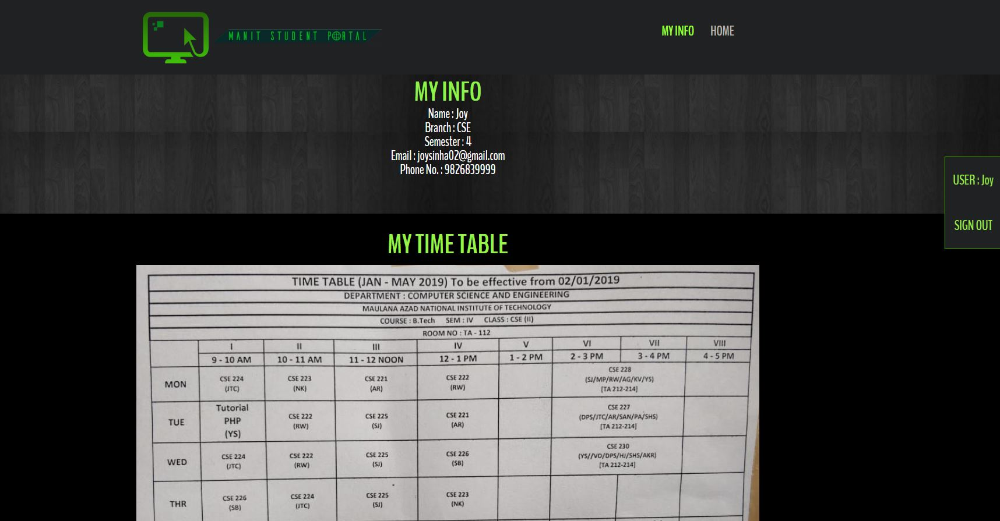
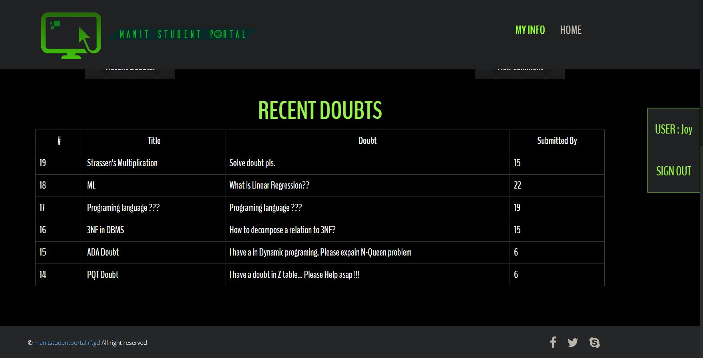
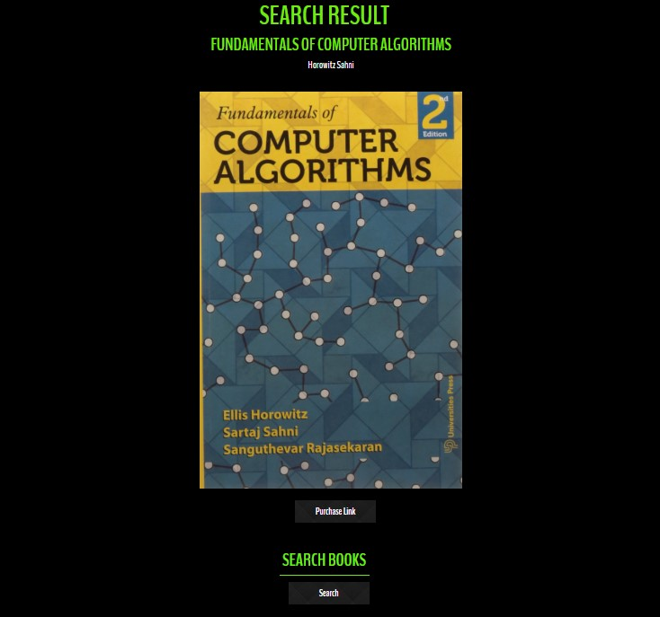

# Student-Doubt-Portal http://manitstudentportal.rf.gd 
A website whose purpose was to give a platform, namely “MANIT Student Portal”, to students of our college for posting their doubts among other features like viewing time tables and course books. Technologies involved were HTML, CSS, Basic Bootstrap, PHP, SQL.

